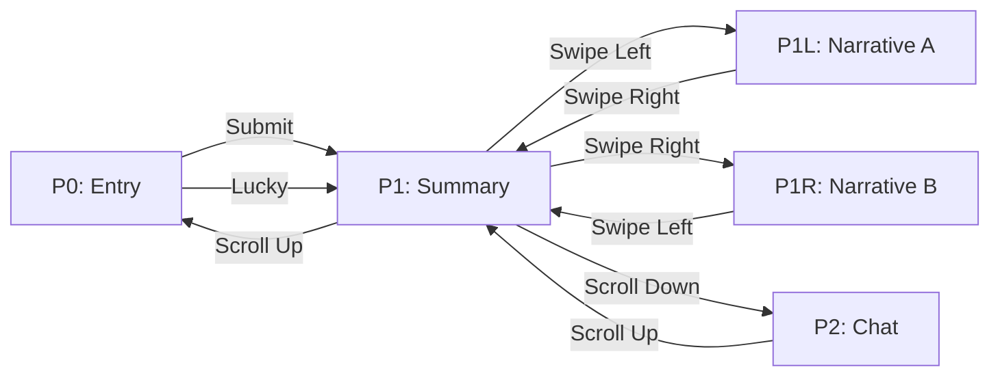

# Narrative Lab — Wireframe Walkthrough (v2: Editorial Style)

Warm & editorial aesthetic — cream backgrounds, serif typography, muted earth-tone palette (burnt sienna, slate blue, deep plum).

---

## Navigation Map


---

## Screen Wireframes

````carousel
### P0 — Entry

- Minimalist Google-style layout on cream background
- Serif logo, single search input (text/link/audio), Submit + I'm Feeling Lucky
- History icon top-right
<!-- slide -->
### P1 — Summary Card

- Full-screen flashcard with sepia-toned image
- Bold serif headline + neutral summary text
- Navigation: ← Narrative A | ↓ Deep Dive | Narrative B →
<!-- slide -->
### P1L — Narrative A: The Security Dilemma

- Story Graph with a clear vertical **timeline flow** (top to bottom)
- Nodes branch off the central time axis
- Swipe right → back to P1
<!-- slide -->
### P1R — Narrative B: Economic Competition

- Story Graph with a clear horizontal **timeline flow** (left to right)
- Different narrative framing of the same events along the time axis
- Swipe left → back to P1
<!-- slide -->
### P2 — Deep Dive Chat

- Warm chat UI with serif typography
- Structured, evidence-backed AI responses
- Scroll up → back to P1
````

---

## Design Tokens
| Token | Value |
|-------|-------|
| Background | `#FAF7F2` (cream/ivory) |
| Text | `#2C2C2C` (dark charcoal) |
| Events (nodes) | Burnt sienna |
| Forces (nodes) | Slate blue |
| Narratives (nodes) | Deep plum |
| Headings | Serif (Playfair Display / Georgia) |
| Body | Serif (Source Serif Pro / Georgia) |
